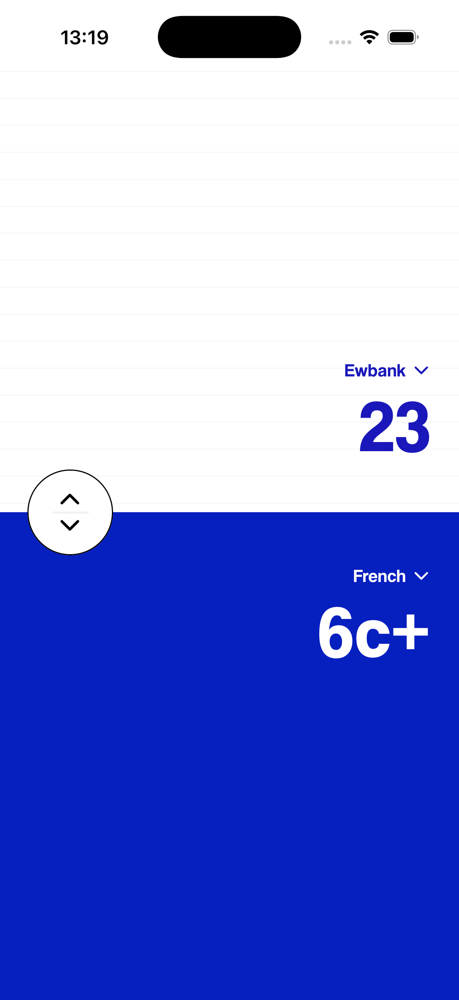
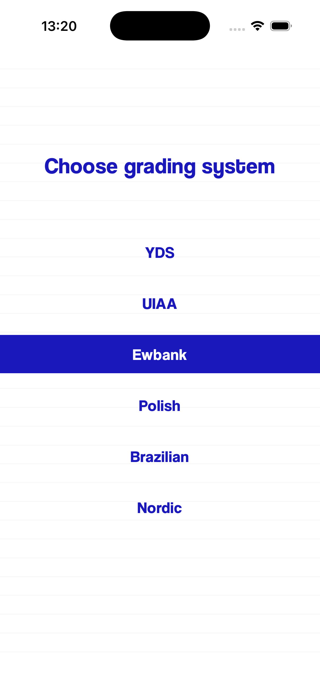

# Gradiator

  

Gradiator is a lightweight React Native (Expo) app for climbers to convert and compare climbing difficulty grades across international grading systems. Slide to select a grade and view equivalent grades in several systems — helpful for planning climbs, logging routes, or learning international grade equivalents.

## Features

- Convert between common climbing grade systems (French, YDS, UIAA, Ewbank, Polish, Brazilian, Nordic)
- Interactive vertical slider for fast grade selection
- Pick which grading systems are shown and compare top/bottom choices
- Small, offline grade table stored in the app (`src/data/grades.ts`)

## Screenshots





---

## Prerequisites

Install these tools once on your machine before anything else.

### All platforms

| Tool | Version | Install |
|------|---------|---------|
| Node.js | 18 or newer | https://nodejs.org |
| npm | comes with Node | — |

### iOS (macOS only)

| Tool | Notes | Install |
|------|-------|---------|
| Xcode | from the Mac App Store | App Store |
| Xcode Command Line Tools | run `xcode-select --install` | Terminal |
| CocoaPods | `brew install cocoapods` | Homebrew |

### Android

| Tool | Notes | Install |
|------|-------|---------|
| Android Studio | includes the Android SDK and emulator | https://developer.android.com/studio |

---

## First-time setup

### 1. Clone and install dependencies

```bash
git clone <repo-url>
cd Gradiator
npm install
```

### 2. Generate native project files

This step creates the `ios/` and `android/` folders with all native code. Only needed once (or after changing native dependencies in `app.json`).

```bash
# iOS only
npx expo prebuild --platform ios

# Android only
npx expo prebuild --platform android

# Both platforms
npx expo prebuild
```

> If you already have `ios/` or `android/` folders and want a clean slate, add `--clean`:
> ```bash
> npx expo prebuild --clean
> ```

### 3. Install iOS native dependencies (iOS only)

CocoaPods is run automatically by `expo prebuild`, but if you need to re-run it manually:

```bash
cd ios && pod install && cd ..
```

---

## Running the app

### Step 1 — Start the Metro bundler

Open a terminal in the project root and run:

```bash
npx expo start --clear
```

Leave this running. Metro serves the JavaScript bundle to the app.

### Step 2 — Launch on a device or simulator

**iOS simulator** (macOS only):

```bash
npx expo run:ios
```

Or, if the app is already installed on a booted simulator, launch it directly:

```bash
xcrun simctl launch booted com.gabwowce.gradiator
```

**Android emulator / device:**

```bash
npx expo run:android
```

---

## Running again (after first-time setup)

Once the native app is installed on your simulator or device, you only need to restart Metro and relaunch the app — no rebuild required.

```bash
# Terminal 1 — start Metro
npx expo start

# Terminal 2 (or use the 'i' / 'a' shortcut in the Metro output)
# iOS simulator
xcrun simctl launch booted com.gabwowce.gradiator

# Android emulator
# Press 'a' in the Metro terminal, or open the app manually on the device
```

If the app shows a connection error, make sure Metro is running on port 8081 before launching the app.

---

## Project layout

```
Gradiator/
├── App.tsx                          # Entry point: font loading and splash screen
├── index.ts                         # Registers the root component with Expo
├── app.json                         # Expo configuration (bundle ID, icons, etc.)
├── babel.config.js                  # Babel config (babel-preset-expo)
├── metro.config.js                  # Metro bundler config
├── src/
│   ├── screens/
│   │   └── HomeScreen.tsx           # Main UI: slider and grade card
│   ├── components/
│   │   ├── GradeCard.tsx            # Displays selected grade and equivalents
│   │   ├── VerticalSlider.ios.tsx   # iOS grade selection slider
│   │   ├── VerticalSlider.android.tsx  # Android grade selection slider
│   │   └── config/sliderConfig.ts  # Slider constants (sensitivity, padding, etc.)
│   ├── context/
│   │   ├── AppContext.tsx           # Global state: grade index, systems, animation
│   │   └── MaskContext.tsx          # Shared animation values for the blue bar mask
│   ├── data/
│   │   ├── grades.ts                # Grade mapping table (edit to add/change grades)
│   │   └── systems.ts              # List of supported grading systems
│   └── hooks/                       # Utility hooks
└── assets/                          # Icons, fonts, screenshots
```

To add or change grade mappings, edit `src/data/grades.ts`.

---

## Troubleshooting

**"Unable to resolve" errors in Metro**
Make sure your `.watchmanconfig` does not exclude `node_modules`. The file should contain `{}` or be empty.

**CocoaPods not found**
Install via Homebrew: `brew install cocoapods`

**App opens but shows a blank screen or connection error**
Metro is not running. Start it with `npx expo start` and relaunch the app.

**Need to rebuild after changing native dependencies**
Re-run `npx expo prebuild` (add `--clean` for a fresh build) followed by `npx expo run:ios` or `npx expo run:android`.

---

## License

MIT — see [LICENSE](LICENSE).
